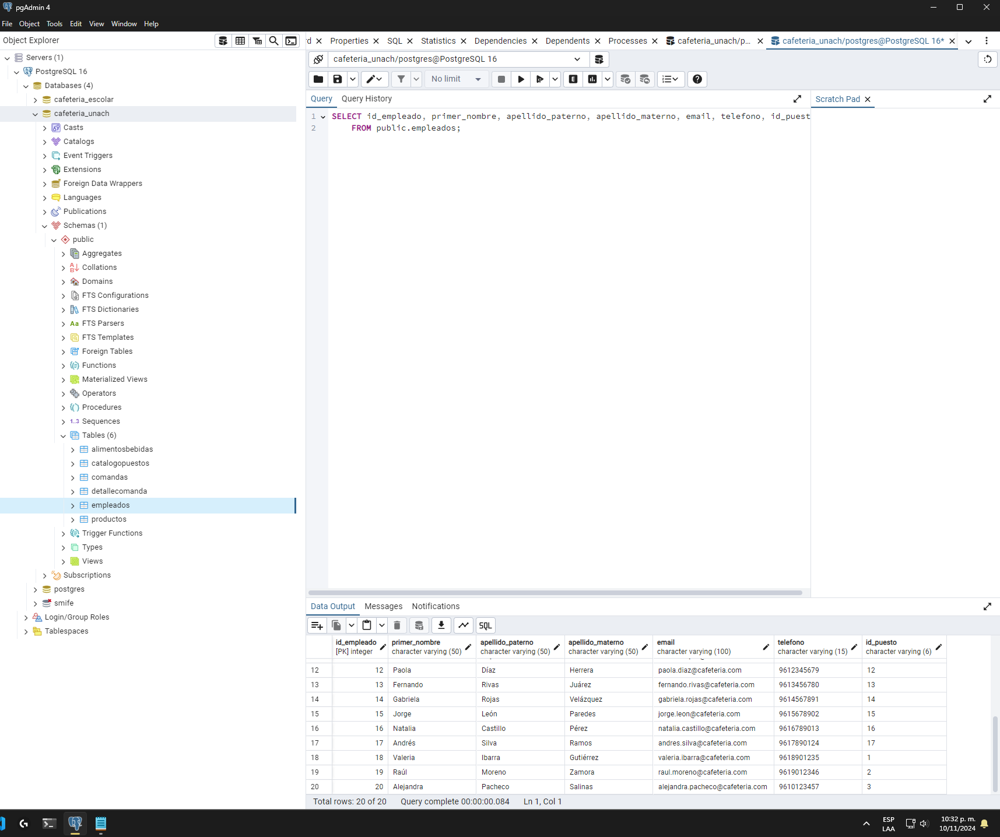
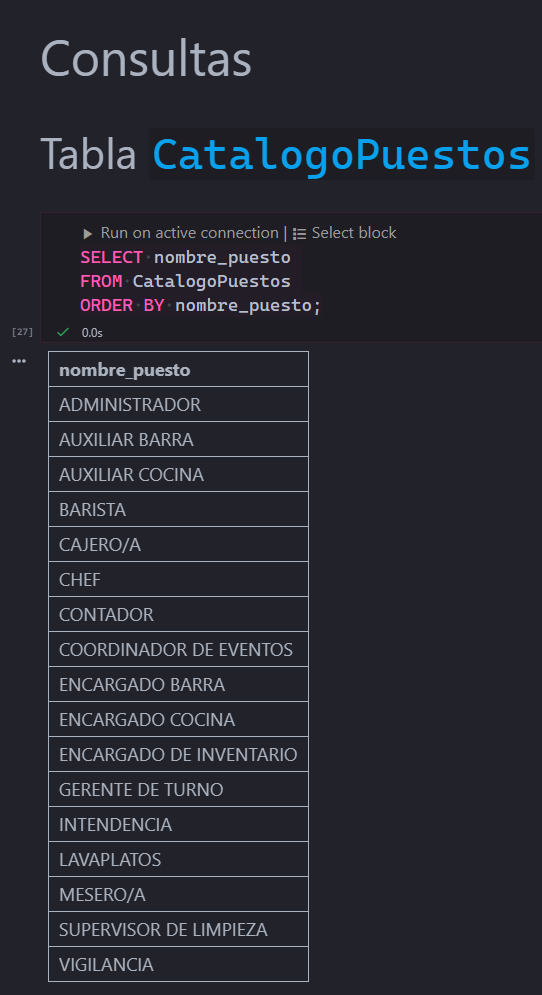
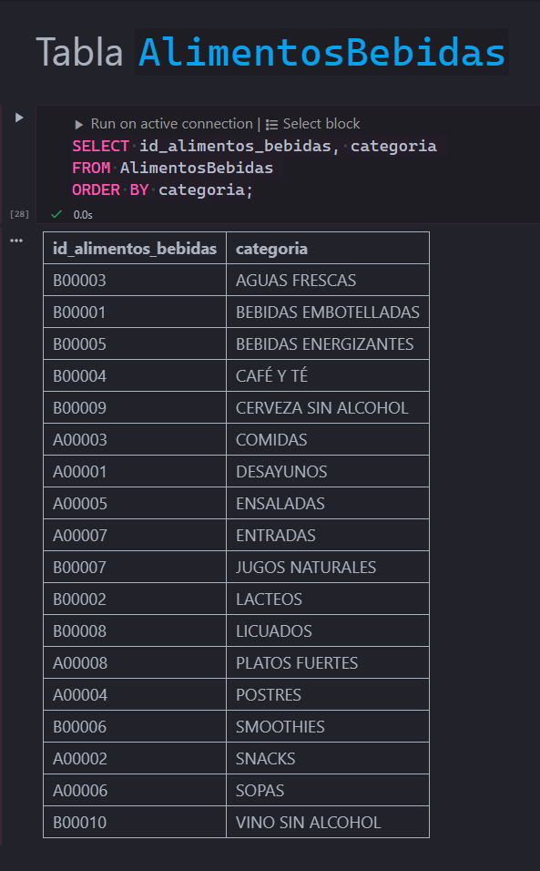
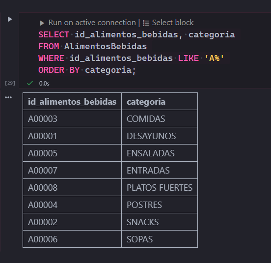
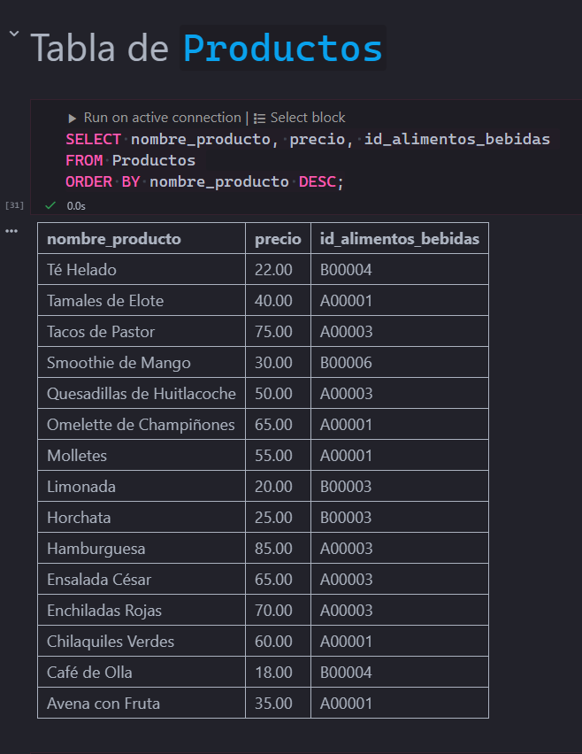
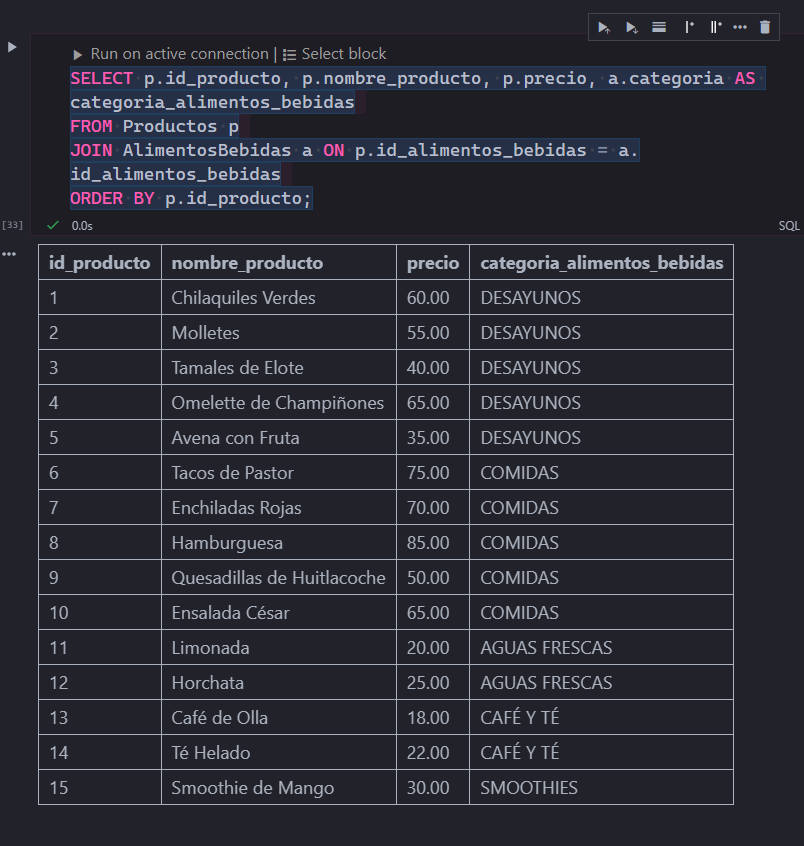
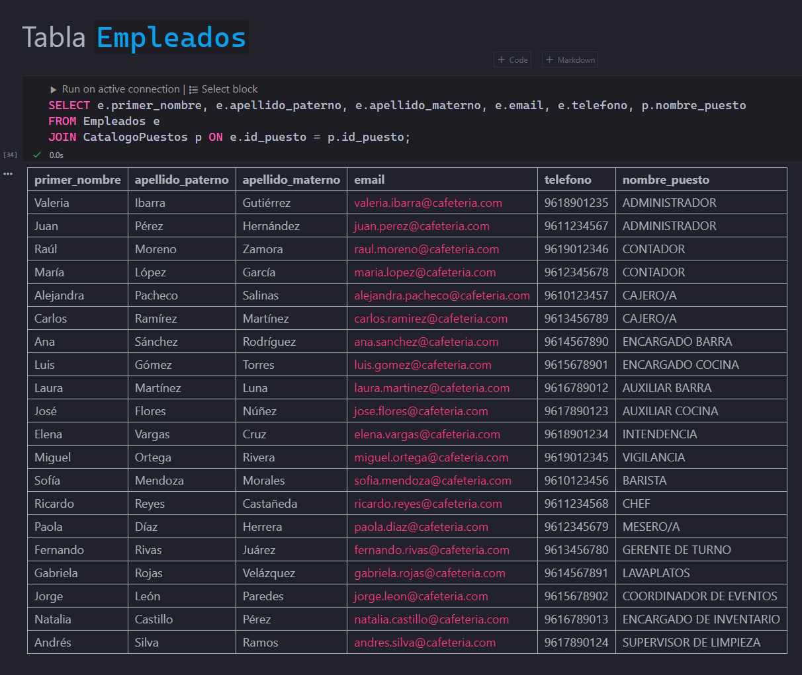
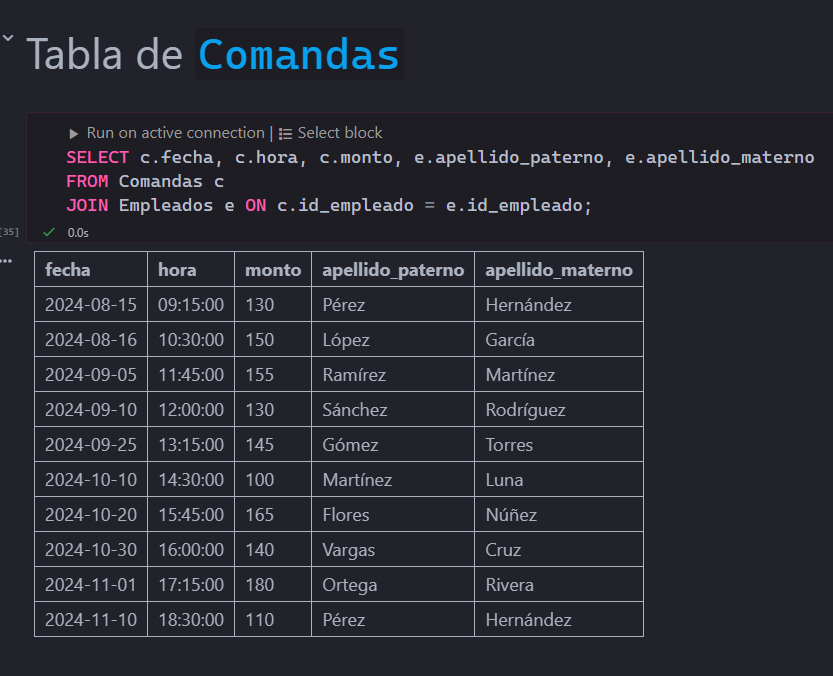
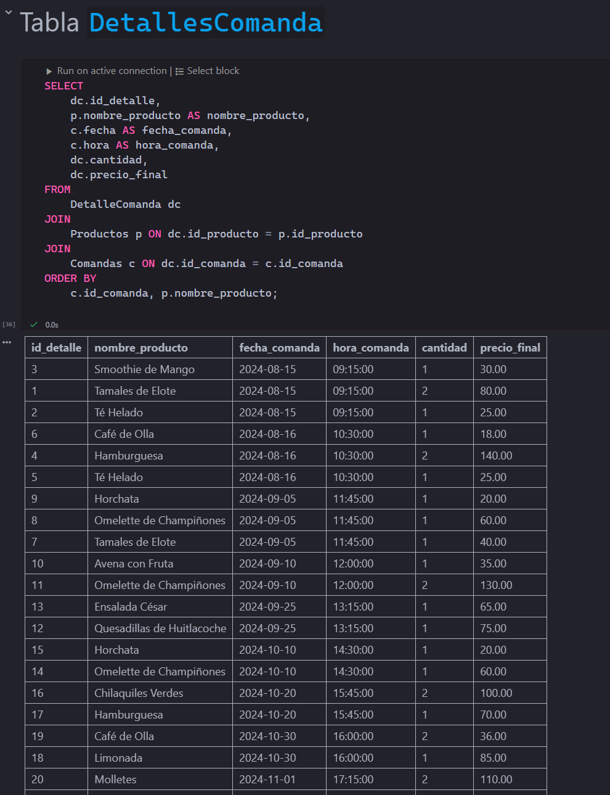
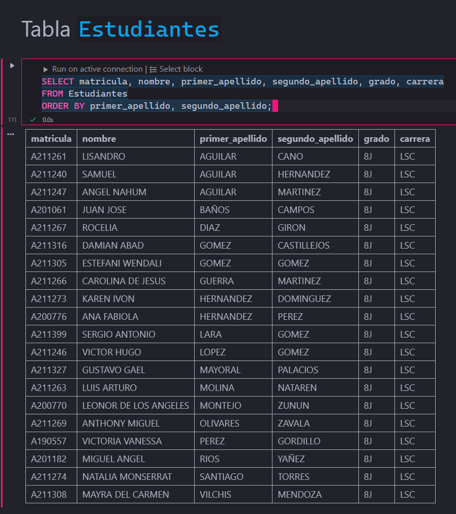

# 🗃️ SQL Database Project - Cafetería

Este proyecto implementa una base de datos SQL para gestionar las operaciones de una cafetería, incluyendo la gestión de productos, empleados, comandas, y detalles de cada transacción. La base de datos facilita la administración de inventarios, control de ventas y asignación de roles del personal.

---

## 📋 Contenido del Proyecto

- **Estructura de la Base de Datos**: Scripts SQL para la creación y definición de las tablas.
- **Inserción de Datos**: Scripts para agregar registros de ejemplo a las tablas, representando un escenario operativo real de la cafetería.
- **Consultas SQL**: Consultas optimizadas para realizar análisis y obtener información relevante.

---

## 🗂️ Estructura de la Base de Datos

La base de datos contiene las siguientes tablas:

1. **CatalogoPuestos**: Define los distintos puestos laborales en la cafetería.
2. **AlimentosBebidas**: Clasifica los tipos de alimentos y bebidas disponibles.
3. **Productos**: Lista de productos de la cafetería, incluyendo el precio y la categoría.
4. **Empleados**: Información sobre el personal de la cafetería, su nombre, contacto y posición.
5. **Comandas**: Registro de cada transacción realizada en la cafetería.
6. **DetalleComanda**: Detalle de cada producto vendido en cada comanda.
7. **Estudiantes**: Almacena la información personal y académica de los estudiantes.

---

## 📜 Scripts

1. **Script de Creación de Tablas**: Este script (`create_tables.sql`) crea todas las tablas necesarias en la base de datos, junto con sus claves primarias y relaciones.
2. **Script de Inserción de Datos**: Este script (`insert_data.sql`) añade registros de muestra en cada tabla para simular un entorno de producción.
3. **Consultas SQL**: El archivo `queries.sql` incluye consultas comunes para recuperar y analizar datos de la base de datos, tales como:

   - Visualización de todos los productos.
   - Filtrado de productos por precio.
   - Consulta de detalles de comandas con el nombre del producto y la fecha/hora.

---

## Documentación de la Base de Datos

Este documento describe la estructura de la base de datos utilizada para la gestión de una cafetería. A continuación, se detallan las tablas que componen la base de datos, junto con una breve explicación de cada una de ellas y sus columnas.

### 1. **CatalogoPuestos**

La tabla `CatalogoPuestos` almacena los diferentes puestos o roles dentro de la cafetería.

| **Columna**     | **Tipo de Dato**  | **Descripción**                       |
|-----------------|-------------------|---------------------------------------|
| `id_puesto`     | `VARCHAR(6)`       | Identificador único del puesto. (Clave primaria) |
| `nombre_puesto` | `VARCHAR(35)`      | Nombre del puesto en la cafetería.    |

---

### 2. **AlimentosBebidas**

La tabla `AlimentosBebidas` categoriza los productos en la cafetería.

| **Columna**          | **Tipo de Dato**  | **Descripción**                               |
|----------------------|-------------------|-----------------------------------------------|
| `id_alimentos_bebidas` | `VARCHAR(6)`       | Identificador único de la categoría. (Clave primaria) |
| `categoria`          | `VARCHAR(35)`      | Nombre de la categoría (Ej. Desayunos, Bebidas). |

---

### 3. **Productos**

La tabla `Productos` almacena los productos que se venden en la cafetería. Esta tabla está relacionada con la tabla `AlimentosBebidas`.

| **Columna**        | **Tipo de Dato**   | **Descripción**                                          |
|--------------------|--------------------|----------------------------------------------------------|
| `id_producto`      | `SERIAL`           | Identificador único del producto. (Clave primaria)       |
| `nombre_producto`  | `VARCHAR(50)`      | Nombre del producto.                                      |
| `precio`           | `DECIMAL(10, 2)`   | Precio del producto.                                      |
| `id_alimentos_bebidas` | `VARCHAR(6)`   | Clave foránea que referencia la tabla `AlimentosBebidas`. |

---

### 4. **Empleados**

La tabla `Empleados` almacena información sobre los empleados de la cafetería.

| **Columna**        | **Tipo de Dato**   | **Descripción**                                          |
|--------------------|--------------------|----------------------------------------------------------|
| `id_empleado`      | `SERIAL`           | Identificador único del empleado. (Clave primaria)       |
| `primer_nombre`    | `VARCHAR(50)`      | Primer nombre del empleado.                              |
| `apellido_paterno` | `VARCHAR(50)`      | Apellido paterno del empleado.                           |
| `apellido_materno` | `VARCHAR(50)`      | Apellido materno del empleado.                           |
| `email`            | `VARCHAR(100)`     | Correo electrónico único del empleado.                   |
| `telefono`         | `VARCHAR(15)`      | Número de teléfono del empleado.                         |
| `id_puesto`        | `VARCHAR(6)`       | Clave foránea que referencia la tabla `CatalogoPuestos`. |

---

### 5. **Comandas**

La tabla `Comandas` registra la información de las comandas realizadas por los clientes.

| **Columna**        | **Tipo de Dato**   | **Descripción**                                          |
|--------------------|--------------------|----------------------------------------------------------|
| `id_comanda`       | `SERIAL`           | Identificador único de la comanda. (Clave primaria)      |
| `fecha`            | `DATE`             | Fecha en la que se realiza la comanda.                   |
| `hora`             | `TIME`             | Hora en la que se realiza la comanda.                    |
| `monto`            | `FLOAT`            | Monto total de la comanda.                               |
| `id_empleado`      | `INT`              | Clave foránea que referencia a la tabla `Empleados`.     |

---

### 6. **DetalleComanda**

La tabla `DetalleComanda` registra los productos específicos de cada comanda, incluyendo la cantidad y el precio final.

| **Columna**        | **Tipo de Dato**   | **Descripción**                                          |
|--------------------|--------------------|----------------------------------------------------------|
| `id_detalle`       | `SERIAL`           | Identificador único del detalle. (Clave primaria)        |
| `id_producto`      | `INT`              | Clave foránea que referencia la tabla `Productos`.       |
| `id_comanda`       | `INT`              | Clave foránea que referencia la tabla `Comandas`.        |
| `cantidad`         | `INT`              | Cantidad de productos en la comanda.                     |
| `precio_final`     | `DECIMAL(10, 2)`   | Precio final del producto en la comanda.                 |

---

### 7. **Estudiantes**

La tabla `Estudiantes` almacena la información personal y académica de los estudiantes.

| **Columna**        | **Tipo de Dato**   | **Descripción**                                          |
|--------------------|--------------------|----------------------------------------------------------|
| `matricula`        | `VARCHAR(8)`       | Identificador único del estudiante. (Clave primaria)     |
| `nombre`           | `VARCHAR(50)`      | Primer nombre del estudiante.                            |
| `primer_apellido`  | `VARCHAR(50)`      | Primer apellido del estudiante.                          |
| `segundo_apellido` | `VARCHAR(50)`      | Segundo apellido del estudiante.                         |
| `grado`            | `VARCHAR(5)`       | Grado académico del estudiante (por ejemplo, "8J" para grado o semestre). |
| `carrera`          | `VARCHAR(5)`       | Carrera que cursa el estudiante (por ejemplo, "LSC" para Licenciatura en Ciencias de la Computación). |

---

#### Relaciones entre las Tablas

- **`Productos`** está relacionada con **`AlimentosBebidas`** a través de la columna `id_alimentos_bebidas`.
- **`Empleados`** está relacionada con **`CatalogoPuestos`** a través de la columna `id_puesto`.
- **`Comandas`** está relacionada con **`Empleados`** a través de la columna `id_empleado`.
- **`DetalleComanda`** está relacionada con **`Productos`** y **`Comandas`** a través de las columnas `id_producto` y `id_comanda`, respectivamente.

---

### Consulta para obtener todos los puestos ordenados por nombre

---

### Consulta para obtener todos los alimentos y bebidas ordenados por categoría

---

### Consulta para obtener solo las categorías que comienzan con "A"

---

### Consulta para obtener solo las categorías que comienzan con "B"

---

### Consulta para obtener todos los productos ordenados por nombre (de forma descendente)

---

### Consulta para obtener todos los empleados

---

### Consulta para ver comandas y detallesComandas

---

### Consulta para ver Estudiantes

