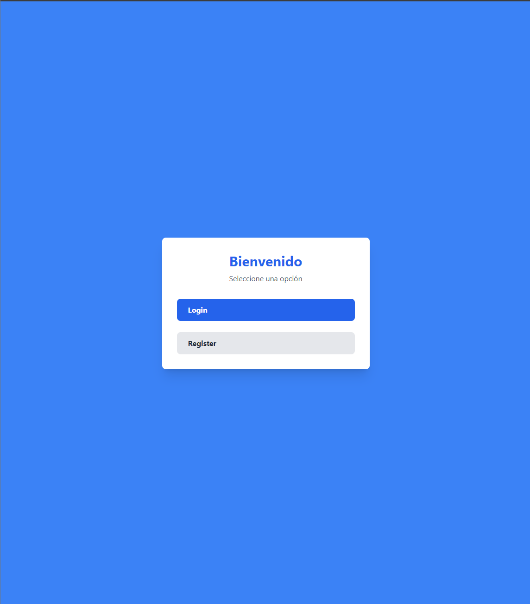

# **Frontend de Aplicación de Registro y Login**

Este proyecto es el frontend de una aplicación web para registro y login, desarrollado con **React** y **TypeScript**, utilizando **Vite** como herramienta de construcción. La aplicación interactúa con una API creada en Flask, y se incluyen funcionalidades para la autenticación, navegación protegida y notificaciones.

## **Tecnologías Utilizadas**

- **React**: Biblioteca para construir interfaces de usuario.
- **TypeScript**: Superset de JavaScript que añade tipado estático.
- **Vite**: Herramienta rápida y moderna para el desarrollo de aplicaciones web.
- **React-Router-Dom**: Manejo de rutas y navegación en la aplicación.
- **React-Toastify**: Gestión de notificaciones amigables para el usuario.
- **TailwindCSS**: Estilización rápida y moderna.

---

## **Instalación y Configuración**

### **Requisitos Previos**

1. Node.js (versión 22.11.0 LTS  o superior)
2. npm o yarn

### **Pasos para Ejecutar el Proyecto**

1. **Clonar el Repositorio**

   ```bash
   git clone <repo>
   cd frontend-flask-app
   ```

2. **Instalar Dependecias**

```bash
npm install
```

3. **Ejecutar el Proyecto**

```bash
npm run dev -- --open
```

El proyecto estará disponible en: _<https://localhost:5173>_

---

## Estructura del Proyecto

```plaintext
src/
├── assets/          # Recursos estáticos como imágenes y estilos globales
├── components/      # Componentes reutilizables (botones, formularios, etc.)
├── lib/             # Lógica para manejar peticiones API, utilidades y hooks
├── pages/           # Páginas principales de la aplicación
├── routes/          # Definición y protección de rutas
├── App.tsx          # Componente principal que define la estructura de la app
├── index.css        # Archivo de estilos base
├── main.tsx         # Punto de entrada de la aplicación

```

## Funcionalidades

### 1. Registro de Usuarios

Permite a los usuarios registrarse mediante un formulario que captura username, email y password.
La información se envía al endpoint de la API Flask (/api/register).

### 2. Login

Autenticación mediante username y password.
Al iniciar sesión correctamente, el token de acceso es almacenado en localStorage.

### 3. Navegación Protegida

Páginas específicas están protegidas mediante un sistema de rutas privadas. Solo se puede acceder si el usuario está autenticado.

### 4. Notificaciones

Se utilizan notificaciones amigables para mostrar mensajes de éxito o error mediante React-Toastify.

### 5. Logout

Al cerrar sesión, el token de acceso se elimina y el usuario es redirigido al home.

## **Dependencias Clave**

| Paquete            | Propósito                                                   |
|--------------------|-----------------------------------------------------------|
| `react`            | Construcción de componentes y manejo de estado.            |
| `react-router-dom` | Gestión de rutas y navegación en la aplicación.            |
| `react-toastify`   | Notificaciones amigables para mostrar mensajes al usuario. |
| `vite`             | Herramienta de desarrollo rápida y moderna.                |
| `tailwindcss`      | Framework de CSS para estilos rápidos y consistentes.      |

---


